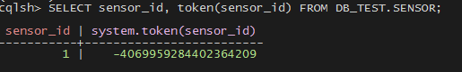
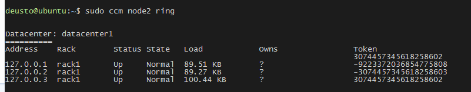
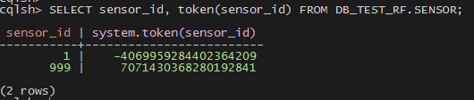
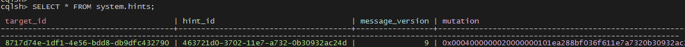
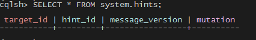

# Practise: Cassandra CCM

### Caveats

+ A working python installation (tested to work with python 2.7).
+ pyYAML (http://pyyaml.org/ -- sudo easy_install pyYaml)
+ six (https://pypi.python.org/pypi/six -- sudo easy_install six)
+ ant (http://ant.apache.org/, on Mac OS X, brew install ant)
+ psutil (https://pypi.python.org/pypi/psutil)

### Install

```bash
$ sudo apt-get install python-pip
$ sudo pip install --upgrade pip
$ sudo pip install pyYAML six ant psutil
$ sudo pip install ccm
```

### Exercise 1: First Operations

**_Create Cluster Cassandra_**

```bash
$ sudo ccm create cluster_cassandra -v 2.2.9 -n 3
```

**_Show Status Cluster_**

Cluster list

```bash
$ sudo ccm list
```

Cluster status

```bash
$ sudo ccm status
```

Node cluster status

```bash
$ sudo ccm node1 show
```

**_Start Cluster_**

```bash
$ sudo ccm start
```

**_Connect CQL_**

```bash
$ sudo ccm node1 cqlsh
```

### Exercise 2: Import dataset and querying tables

Inside CQL console in node1 ...

```bash
$ sudo ccm node1 cqlsh
```

**_Download dataset_**

Download dataset from github repository

```bash
cd ~/data && wget https://github.com/adiazgalache/formacion/raw/master/Deusto/dataset/inv_data.csv
```

**_Create Keyspace_**

Create keyspace `db_eje2` with Replication Factor 1

```sql
CREATE KEYSPACE IF NOT EXISTS db_eje2 WITH REPLICATION = { 'class' : 'SimpleStrategy', 'replication_factor' : 1 };
```

**_Create Table_**

Create table `inv_by_medio`:

+ Partition key: keyword, medio
+ Clustering column: fecha

```sql
CREATE TABLE IF NOT EXISTS db_eje2.inv_by_medio (
keyword text,
fecha date,
medio text,
dessop text,
tipospot text,
formato text,
franja text,
inv_p decimal,
PRIMARY KEY ((keyword,medio), fecha)
) WITH CLUSTERING ORDER BY (fecha DESC);
```

**_Import csv file_**

```sql
COPY db_eje2.inv_by_medio (keyword,fecha,medio,dessop,tipospot,formato,franja,inv_p) FROM '/home/deusto/data/inv_data.csv' WITH HEADER=true AND DELIMITER=';';
```

**_Verify_**

```sql
select * from db_eje2.inv_by_medio limit 10;
```

**_Query 1_**

Total num rows:

```sql
select count(*) from db_eje2.inv_by_medio;
```

_Question_

- What's the reason why there are less rows than in the original file?

**_Query 2_**

Total sum inversion where keyword is Orange and medio Internet

```sql
select keyword, medio, sum(inv_p) 
from db_eje2.inv_by_medio 
where keyword = 'orange' and medio = 'INTERNET';
```

**_Query 3_**

Return all rows that investment is greater than 200.

```sql
select *
from db_eje2.inv_by_medio 
where inv_p > 200;
```

_Question_

- Can you explain what happens with this query?

### Exercise 3: Replication

Inside CQL console in node1 ...

```bash
$ sudo ccm node1 cqlsh
```

**_Create Keyspace_**

Create keyspace `db_eje3` with Replication Factor 1

```sql
CREATE KEYSPACE IF NOT EXISTS db_eje3 WITH REPLICATION = { 'class' : 'SimpleStrategy', 'replication_factor' : 1 };
```

Create keyspace `db_eje3_r3` with Replication Factor 3

```sql
CREATE KEYSPACE IF NOT EXISTS db_eje3_r3 WITH REPLICATION = { 'class' : 'SimpleStrategy', 'replication_factor' : 3 };
```

Show keyspaces

```sql
DESC KEYSPACES;
```

**_Create tables_**

```sql
CREATE TABLE IF NOT EXISTS db_eje3.sensor (
sensor_id int,
sensor_name text,
ts timestamp,
PRIMARY KEY (sensor_id,ts)) WITH CLUSTERING ORDER BY (ts DESC);

CREATE TABLE IF NOT EXISTS db_eje3_r3.sensor (
sensor_id int,
sensor_name text,
ts timestamp,
PRIMARY KEY (sensor_id,ts)) WITH CLUSTERING ORDER BY (ts DESC);
```

Show Column Families

```sql
DESC COLUMNFAMILIES;
```

**_Insert Operation_**

_Case 1_

Insert a record in `db_eje3.sensor` table:

```sql
INSERT INTO db_eje3.sensor (sensor_id, sensor_name, ts) VALUES (1,'air polution',dateof(now()));
```

_Case 2_

Insert two records in `db_eje3_r3.sensor` table:

```sql
BEGIN BATCH
INSERT INTO db_eje3_r3.sensor (sensor_id, sensor_name, ts) VALUES (1,'air polution',dateof(now()));
INSERT INTO db_eje3_r3.sensor (sensor_id, sensor_name, ts) VALUES (999,'air flow meter',dateof(now()));
APPLY BATCH;
```

**_Verify_**

_Case 1_

```sql
SELECT sensor_id, token(sensor_id) FROM db_eje3.sensor;
```

Another way. Return data in JSON format!

```sql
SELECT JSON sensor_id, token(sensor_id) FROM db_eje3.sensor;
```







_Case 2_

```sql
SELECT sensor_id, token(sensor_id) FROM db_eje3_r3.sensor;
```



_Questions_

- What is the coordinator node?
- How many copies are there?
- Where are the originals and copies?

_Solution_

In other ssh session, launch:

```bash
sudo ccm node1 nodetool getendpoints db_eje3 sensor 1
sudo ccm node1 nodetool getendpoints db_eje3_r3 sensor 999
```

### Exercise 4: Fail Over

**_Calculate token_**

We use sensor_id = 2. Discover the associated token:

```bash
$ sudo ccm node1 nodetool getendpoints db_eje3_r3 sensor 2
```

**_Shutdown the node2_**

```bash
$ sudo ccm node2 stop
```

**_Insert Row_**

Connect to CQL node1
```bash
$ sudo ccm node1 cqlsh
```

Insert row in column family db_eje3...
```sql
INSERT INTO db_eje3.sensor (sensor_id, sensor_name, ts) VALUES (2,'speed sensor',dateof(now()));
```

_Question_

- Can you explain what happens with this query?

Insert row in column family db_eje3_r3...

```sql
INSERT INTO db_eje3_r3.sensor (sensor_id, sensor_name, ts) VALUES (2,'speed sensor',dateof(now()));
```

```sql
SELECT * FROM db_eje3_r3.sensor;
```

**_Verify hints table for the fallen node_**

```sql
SELECT * FROM system.hints;
```



**_Start the node_**

```bash
$ sudo ccm node2 start
```

**_Check again hints table_**

```sql
SELECT * FROM system.hints;
```




