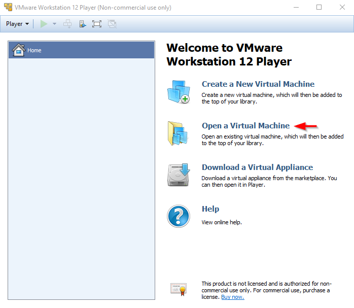
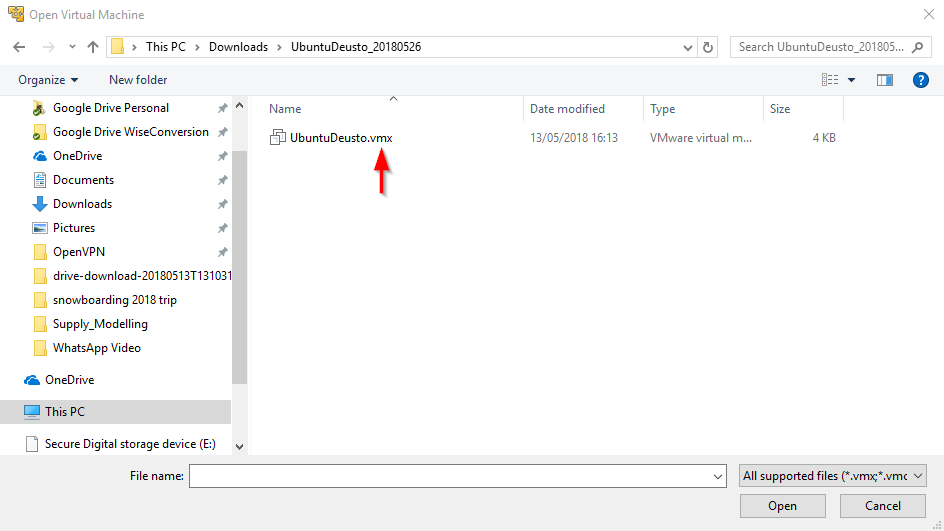
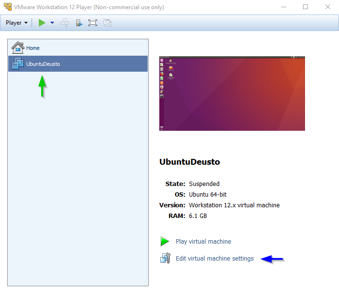
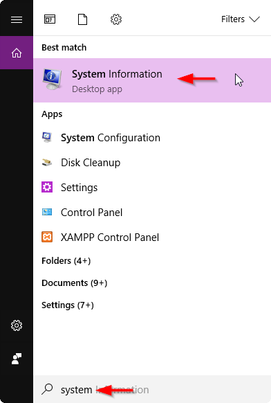
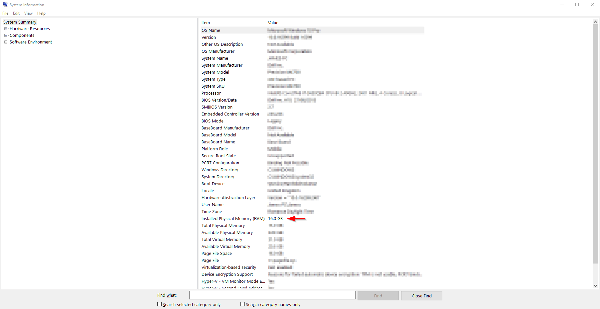
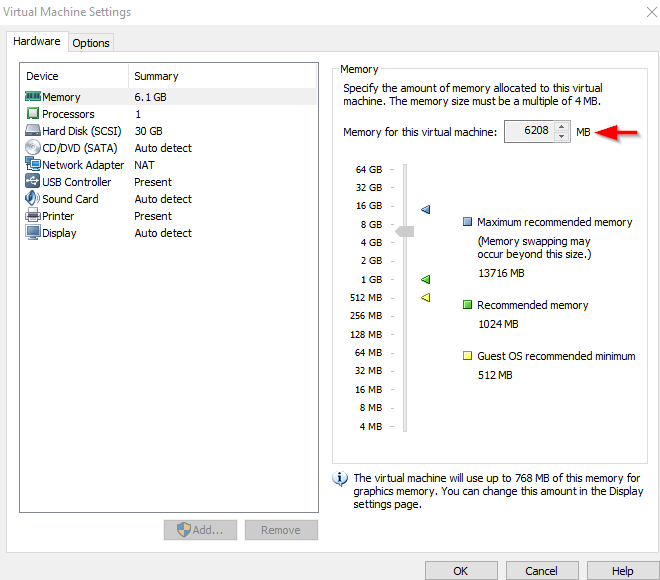

# Instalación de máquina virtual con VMWare

### Descarga de máquina virtual y VMWare player
+ **[VMWare player](https://my.vmware.com/en/web/vmware/free#desktop_end_user_computing/vmware_workstation_player/14_0)** nos permite ejectuar una máquina virtual de Linux Ubuntu (puede variar en Mac)
+ **[Nuestro máquina virtual en Zip](https://drive.google.com/open?id=1y1YX_7IMQX26o5229ooSnk6gqCOKqN3O)** que contiene el OS que vamos a usar en clase con todo pre-installado

### Arrancar máquina virtual con VMWare
+ Abrir e Instalar VMWare player siguiendo el wizard
+ Descomprimir el archivo zip que contiene la máquina virtual
+ Abrir *VMWare Player*
+ Una vez abierto, elige *Open a Virtual Machine*

+ Eso muestra una ventana de dialogo *Open Virtual Machine*, seleccionar la carpeta donde has descomprimido la maquina virtual y elige el archivo `UbuntuDeusto.vmx`

+ El dialogo muestra la máquina virtual a la izquierda (flecha verde). El siguiente paso es asegurarnos que tiene la memoria necesaria para el desarrollo de la práctica. Pincha sobre la máquina y después _Edit virtual machine settings_ (flecha azul), eso abre el dialogo de _virtual machine settings_

+ Una vez abierto, elige la memoria adecuada en función de las características de su máquina - como guía, debería poner mínimo 3GB de memoria, y como deseable 6GB. Como regla, se recomienda no exceder del 30% de la memoria total de su máquina. Si desea conocer las características de su máquina, puede hacerlo con estas simples instrucciones (válidas para entornos Windows):

    + Buscar _System Information_
    

    + Encontrar la memoria disponible
    

+ Ajustar la memoria de la máquina virtual, teniendo en cuenta las notas anteriores:

+ Una vez ajustado, cierra este dialogo pinchando _OK_ y se guardarán las preferencias automáticamente.

+ Puede arrancar la máquina tocando el botón de _play_ después de seleccionar la misma:

	+ Las credenciales de acceso son: _deusto_ / _deusto_